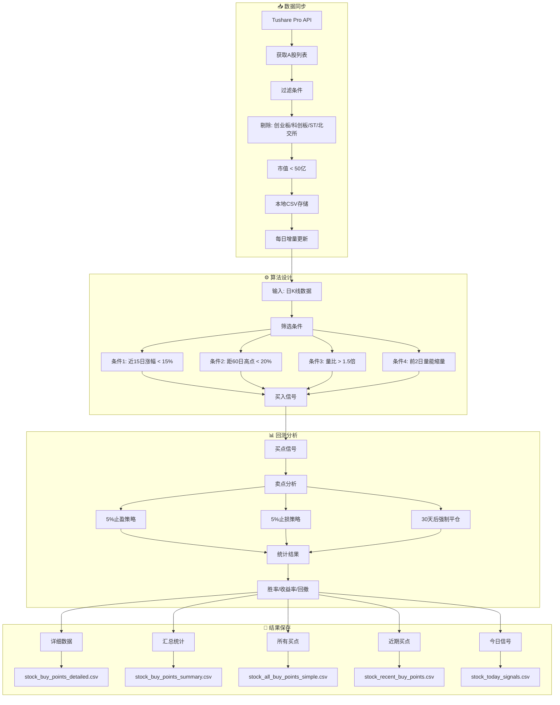
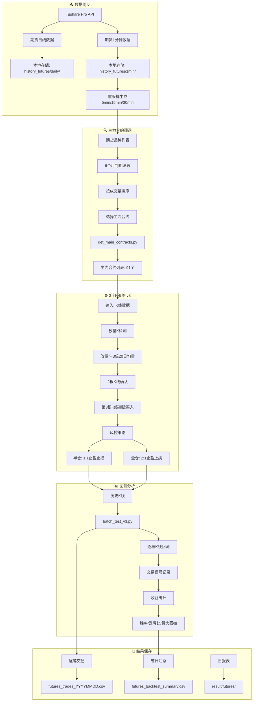

# 量化交易系统工作流程图

## 一、A股选股系统工作流程



---

## 二、期货交易系统工作流程



---

## 三、关键文件对应关系

### A股选股

| 阶段 | 文件 | 说明 |
|------|------|------|
| 数据获取 | `stock_selector.py` | Tushare获取股票列表 |
| 数据过滤 | `stock_selector.py` | 剔除创业板/科创板/ST |
| 数据存储 | `data/history_stocks/*.csv` | 本地日线数据 |
| 选股算法 | `stock_selector.py:check_buy_points_all()` | 买点筛选 |
| 卖点分析 | `stock_selector.py:analyze_buy_point()` | 5%止盈止损 |
| 回测 | `stock_selector.py` | 历史买点分析 |
| 结果 | `result/stock_*.csv` | 多维度结果文件 |

### 期货交易

| 阶段 | 文件 | 说明 |
|------|------|------|
| 数据获取 | `refresh_main_contracts.py` | 主力合约数据 |
| 主力筛选 | `get_main_contracts.py` | 成交量最大的合约 |
| 数据存储 | `data/history_futures/5min/*.csv` | 5分钟K线数据 |
| 策略 | `strategy/strategy_3consecutive_kline_v3.py` | 3连K策略 |
| 回测 | `strategy/batch_test_v3.py` | 批量回测 |
| 结果 | `result/futures/*.csv` | 交易记录和统计 |

---

## 四、数据流向图

```
┌─────────────────────────────────────────────────────────────────────┐
│                         数据源: Tushare Pro                          │
└─────────────────────────────────────────────────────────────────────┘
                                    │
            ┌───────────────────────┴───────────────────────┐
            ▼                                               ▼
   ┌─────────────────────┐                        ┌─────────────────────┐
   │    期货数据流        │                        │    A股数据流         │
   ├─────────────────────┤                        ├─────────────────────┤
   │ • 日线数据          │                        │ • 股票列表           │
   │ • 1分钟数据         │                        │ • 日线数据           │
   │ • 主力合约信息      │                        │ • 市值数据           │
   └─────────┬───────────┘                        └─────────┬───────────┘
             │                                             │
             ▼                                             ▼
   ┌─────────────────────┐                        ┌─────────────────────┐
   │   本地存储           │                        │   本地存储           │
   ├─────────────────────┤                        ├─────────────────────┤
   │ history_futures/    │                        │ history_stocks/     │
   │   ├── daily/        │                        │   ├── shxxxxx.csv   │
   │   ├── 1min/         │                        │   └── szxxxxx.csv   │
   │   └── 5min/         │                        │                     │
   └─────────┬───────────┘                        └─────────┬───────────┘
             │                                             │
             ▼                                             ▼
   ┌─────────────────────┐                        ┌─────────────────────┐
   │   主力合约筛选        │                        │   股票筛选           │
   ├─────────────────────┤                        ├─────────────────────┤
   │ get_main_contracts  │                        │ is_valid_stock      │
   │ • 成交量排序         │                        │ • 板块过滤           │
   │ • 91个主力合约       │                        │ • 市值过滤           │
   └─────────┬───────────┘                        └─────────┬───────────┘
             │                                             │
             ▼                                             ▼
   ┌─────────────────────┐                        ┌─────────────────────┐
   │   3连K策略           │                        │   买点筛选           │
   ├─────────────────────┤                        ├─────────────────────┤
   │ • 放量K检测          │                        │ • 15日涨幅<15%      │
   │ • 2K确认            │                        │ • 距60日高点<20%    │
   │ • 突破买入           │                        │ • 量比>1.5          │
   │ • 止盈止损           │                        │ • 缩量条件           │
   └─────────┬───────────┘                        └─────────┬───────────┘
             │                                             │
             ▼                                             ▼
   ┌─────────────────────┐                        ┌─────────────────────┐
   │   回测分析           │                        │   卖点分析           │
   ├─────────────────────┤                        ├─────────────────────┤
   │ batch_test_v3.py   │                        │ analyze_buy_point   │
   │ • 逐根K线回测       │                        │ • 5%止盈            │
   │ • 交易信号记录       │                        │ • 5%止损            │
   │ • 收益统计           │                        │ • 30天强制平仓       │
   └─────────┬───────────┘                        └─────────┬───────────┘
             │                                             │
             ▼                                             ▼
   ┌─────────────────────┐                        ┌─────────────────────┐
   │   结果保存           │                        │   结果保存           │
   ├─────────────────────┤                        ├─────────────────────┤
   │ futures_trades_*.csv│                        │ stock_buy_points_*.csv│
   │ futures_summary.csv │                        │ • detailed          │
   │                     │                        │ • summary           │
   │                     │                        │ • recent            │
   └─────────────────────┘                        └─────────────────────┘
```

---

## 五、配置文件

### A股配置
```python
# stock_selector_config.py
stocks = []  # 指定股票或
stock_list_file = "a_stock_list.csv"  # 股票列表文件
```

### 期货配置
```json
// realtime_future_config.json
{
    "time_frame": "1min",    // K线周期
    "strategy": "3consecutive_k",
    "contracts": ["ag2506", "cu2506", ...],
    ...
}
```

---

## 六、定时任务建议

| 任务 | 频率 | 内容 |
|------|------|------|
| 期货主力合约刷新 | 每日盘前 | 更新主力合约列表 |
| A股数据同步 | 每日收盘后 | 获取最新行情数据 |
| 期货信号检测 | 实时/每日收盘 | 检测3连K信号 |
| A股选股 | 每日收盘后 | 筛选次日潜在买点 |
| 回测报告 | 每周 | 统计本周表现 |
